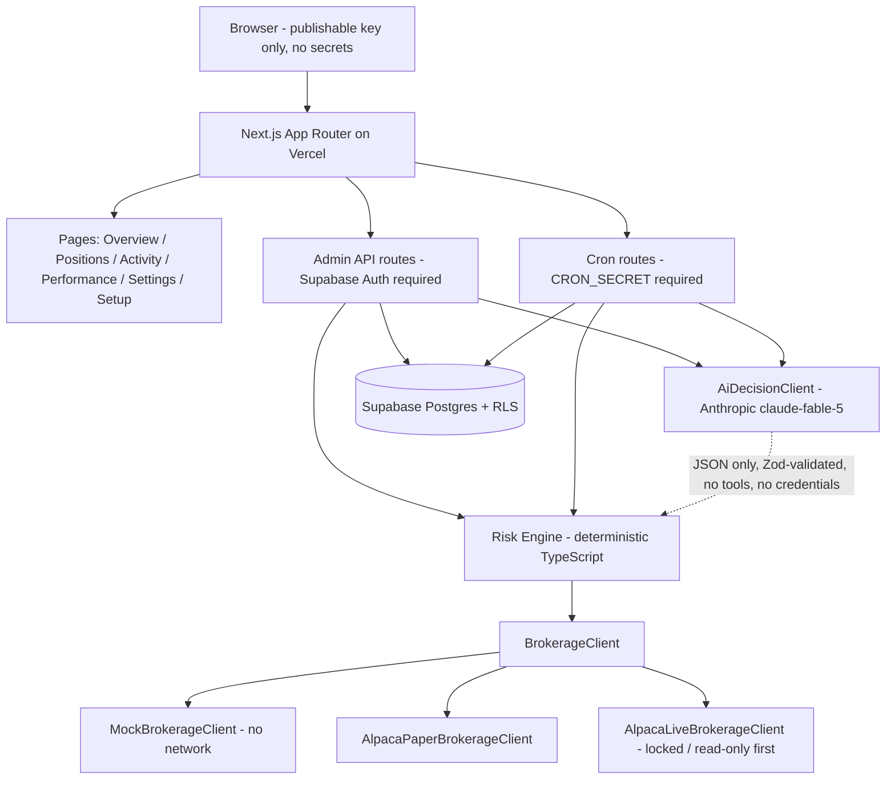

# Fable Fund Lab

A private, single-owner investment dashboard where Claude (`claude-fable-5`) proposes trades
and deterministic TypeScript enforces every boundary. Runs fully in **MOCK mode with zero
credentials**, graduates to **Alpaca paper trading**, and keeps **live trading coded but locked**
behind a deliberate activation ceremony.

> This is a personal tool for managing your own money. It is not investment advice, and it has
> no public signup, customer accounts, or multi-user features by design.

## What it does

- Shows account value, holdings, trades, the AI's brief reasoning, and performance vs SPY.
- Runs a low-frequency (default: once per trading day) AI evaluation that may propose trades.
- Every proposal passes a 22-check deterministic risk engine — twice (at proposal time and
  again on fresh data immediately before execution).
- Manual modes queue trades for your approval; autonomous modes execute automatically after
  all checks; everything is audit-logged.
- Emergency controls: STOP NEW ORDERS, CANCEL OPEN ORDERS, CLOSE ALL POSITIONS, GLOBAL KILL SWITCH.

## Architecture



The AI never touches Alpaca, credentials, settings, limits, or the database. It receives a
read-only portfolio summary and returns JSON that is treated as untrusted input.

## Trading modes

| Mode | Broker | Execution |
|---|---|---|
| `MOCK` (default) | simulated | manual approval |
| `PAPER_MANUAL` | Alpaca paper | manual approval |
| `PAPER_AUTONOMOUS` | Alpaca paper | automatic after risk checks |
| `LIVE_LOCKED` | Alpaca live | **read-only, can never trade** |
| `LIVE_MANUAL` | Alpaca live | manual approval + ceremony |
| `LIVE_AUTONOMOUS` | Alpaca live | automatic + separate ceremony |

Live modes are reachable **only from `LIVE_LOCKED`** after a connectivity check, a kill-switch
test, acknowledgment checkboxes, and typing the exact phrase
(`ENABLE LIVE MANUAL TRADING` / `ENABLE LIVE AUTONOMOUS TRADING`).

## Local startup (mock mode — no accounts needed)

```bash
npm install
npm run dev
# open http://localhost:3000
```

You get a working dashboard seeded with ~$10,000 of simulated history. Try:
Settings → Automation → **Run AI evaluation**, then approve the proposed trade on Overview.

## Setup for paper trading

The in-app **Setup** page tracks all of this with live status badges.

### 1. Supabase (database + login)

1. Open <https://supabase.com> → **New project** (any region, free tier is fine).
2. Project Settings → **API Keys**: copy the *Project URL*, the *publishable* key, and the
   *service_role* (secret) key into `.env.local`:
   - `NEXT_PUBLIC_SUPABASE_URL`
   - `NEXT_PUBLIC_SUPABASE_PUBLISHABLE_KEY`
   - `SUPABASE_SERVICE_ROLE_KEY` (server-only; never share it or commit it)
3. SQL Editor → paste the contents of `supabase/migrations/0001_init.sql` → **Run**.
   This creates all tables, RLS policies, default risk limits, and the seeded symbol allowlist.
4. **Administrator bootstrap**: Authentication → Users → **Add user** → your email + a strong
   password (check “auto-confirm”). Then Authentication → Sign In / Up → disable public signups.
5. Restart `npm run dev`. The app now requires login.

### 2. Anthropic

1. Open <https://console.anthropic.com> → API Keys → **Create key**.
2. Put it in `.env.local` as `ANTHROPIC_API_KEY`. Model is already set: `claude-fable-5`.

### 3. Alpaca paper account

1. Open <https://alpaca.markets> → sign up (paper trading needs no funding).
2. In the dashboard, switch to **Paper Trading** (top-left account selector).
3. Generate API keys → put them in `.env.local` as `ALPACA_PAPER_API_KEY` /
   `ALPACA_PAPER_API_SECRET`.

### 4. App secrets

```bash
openssl rand -hex 32   # run twice; use for CRON_SECRET and APP_ENCRYPTION_KEY
```

> Never paste any of these keys into chats, logs, or issues. `.env.local` is gitignored.

## Going to paper mode

1. Settings → Diagnostics: everything you configured shows **Configured**.
2. Settings → Automation → **Run Health check** — brokerage must show OK.
3. Settings → Trading mode → **PAPER_MANUAL**.
4. Run an AI evaluation; approve a trade; verify it in the Alpaca paper dashboard.
5. After several good sessions, consider **PAPER_AUTONOMOUS** (requires explicit acknowledgment).

## Deployment (GitHub + Vercel)

1. Create an empty GitHub repository (no README).
2. `git remote add origin <your-repo-url> && git push -u origin main`
3. Open <https://vercel.com> → **Add New → Project** → import the repo (defaults are fine).
4. Project → Settings → **Environment Variables**: add every variable from `.env.example`
   that you use locally (paper + Supabase + Anthropic + `CRON_SECRET`). Do **not** add live keys.
5. Deploy. Cron jobs come from `vercel.json`:
   - `/api/cron/evaluate` — weekdays 15:30 UTC (AI evaluation, idempotent per day)
   - `/api/cron/snapshot` — weekdays 21:10 UTC (post-close snapshot + SPY benchmark)
   - `/api/cron/reconcile` — hourly during market hours
   - `/api/cron/health` — weekdays 13:30 UTC

   On the Vercel **Hobby plan only 2 cron jobs (daily)** are allowed — keep `evaluate` and
   `snapshot`, delete the other two entries, and trigger reconcile via the Settings "Run now"
   button (or upgrade to Pro). Vercel automatically sends
   `Authorization: Bearer $CRON_SECRET` to cron routes.

## Optional email alerts (Resend)

Create a key at <https://resend.com>, then set `RESEND_API_KEY`, `ALERT_EMAIL_TO`,
`ALERT_EMAIL_FROM`. Only WARNING/CRITICAL alerts are emailed; in-app alerts always work.

## Testing

```bash
npm run lint        # ESLint
npm run typecheck   # tsc --noEmit
npm run test        # Vitest: unit + integration (risk engine, modes, AI schema, pipeline)
npm run test:e2e    # Playwright: browser tests against zero-credential mock mode
npm run build       # production build
```

All external APIs are mocked in tests; no credentials are required or contacted.

## Kill switch

- **Engage**: top-bar button or Settings → Emergency controls. Immediately blocks new orders,
  rejects queued proposals, attempts to cancel open brokerage orders, audits, and alerts.
  It persists across restarts (stored in the database).
- **Reset**: requires typing `RESET KILL SWITCH`. Stop-new-orders deliberately stays ON after a
  reset until you disable it separately.

## Future live trading (deliberately hard)

1. Weeks of satisfactory paper results first (Performance page, vs SPY).
2. Open a **separate, isolated** Alpaca live account. Fund it with ≤ $1,000 you can lose.
3. Add `ALPACA_LIVE_API_KEY` / `ALPACA_LIVE_API_SECRET` to the environment.
4. Settings → Trading mode → `LIVE_LOCKED` (read-only) and verify balances.
5. Choose `LIVE_MANUAL` → the activation wizard walks through: connectivity test,
   kill-switch test, acknowledgments, typed phrase, final confirmation.
6. Live limits enforced by code: $1,000 max funded balance, $100 max order, 3 trades/day,
   2% daily-loss halt, 8% drawdown halt, long-only, cash-only, market hours only.

## Troubleshooting

| Symptom | Fix |
|---|---|
| “Brokerage unavailable” banner | Check Alpaca keys in Settings → Diagnostics; run Health check |
| Login loop | Confirm all three Supabase env vars; restart dev server |
| AI evaluation fails | Check `ANTHROPIC_API_KEY`; the error is recorded in the audit log |
| Proposal blocked | Activity page shows the exact failed risk checks |
| Cron 401 | `CRON_SECRET` mismatch between Vercel env and project env |
| Stuck order | Settings → Run Reconcile orders; orders missing remotely for >1h are flagged UNKNOWN |

See [SECURITY.md](SECURITY.md) for the threat model and [HANDOFF.md](HANDOFF.md) for current
project status.

## Strategy Lab v2 (upgrade)

The app now includes a research layer on top of the original pipeline:

- **Strategy Lab** (`/strategy-lab`): five interpretable strategies (trend
  pullback, relative momentum, mean reversion, defensive rotation, AI
  discretionary) with deterministic entry/exit rules, regime eligibility,
  per-strategy paper stats, and deterministic promotion/demotion gates.
  Promotion never reaches live automatically; `LIVE_MANUAL_CANDIDATE` is the
  ceiling and the live ceremonies still apply.
- **Backtesting**: daily-bar engine with next-open fills, transaction-cost and
  slippage assumptions, no look-ahead (tested), full metrics (Sharpe, Sortino,
  profit factor, expectancy, drawdown, costs) and **walk-forward validation**
  with an out-of-sample score and overfitting warnings.
- **Market-data quality layer**: every quote becomes a typed snapshot
  (bid/ask/spread bps/age/liquidity); stale or degraded data blocks execution.
- **Execution-cost model + order policy**: estimated fill, bid-ask cost,
  impact; limit orders preferred, market orders never sent into wide spreads;
  per-symbol / post-loss / post-rejection cooldowns.
- **Market-regime engine**: transparent SPY-based classifier
  (RISK_ON_TREND … VOLATILITY_SPIKE) gates strategies and is stored with every
  proposal and journal entry.
- **Paper Journal** (`/paper-journal`): every executed decision with thesis,
  counterargument, invalidation condition, quote snapshot, cost estimate;
  round-trip P/L before/after estimated costs; CSV export.
- **Cross-Market Research** (`/cross-market`): read-only Polymarket (Gamma +
  public CLOB) vs model-based external probabilities. Reports *divergence*
  (never "arbitrage" unless settlement genuinely matches — and it labels
  mismatches). No wallet, no execution, no path to Alpaca.
- **Optional Discord alerts**: set `DISCORD_WEBHOOK_URL` (server-only).
- **CI**: `.github/workflows/ci.yml` runs lint, typecheck, unit tests, build,
  and Playwright on every push/PR.

Interpretation notes: estimated costs are model-based (spread + participation
impact), Alpaca paper fills are optimistic vs live, IEX feed quotes can differ
from consolidated tape, and a positive backtest is **not** proof a strategy
works — the walk-forward warnings exist precisely for that reason.
